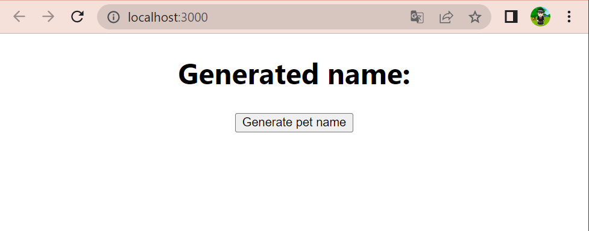

# name-generator-client

Simple client for testing name-generator-backend service.

## How to run:
1. Install nodejs and npm
2. install react globally (`npm install --save react`): https://www.codecademy.com/article/react-setup-i
3. Run with 
`npm run start` or `yarn run start` (equals to `react-scripts start`)

## API

**GET /api/generate** - endpoint to fetch generated name without parameters
